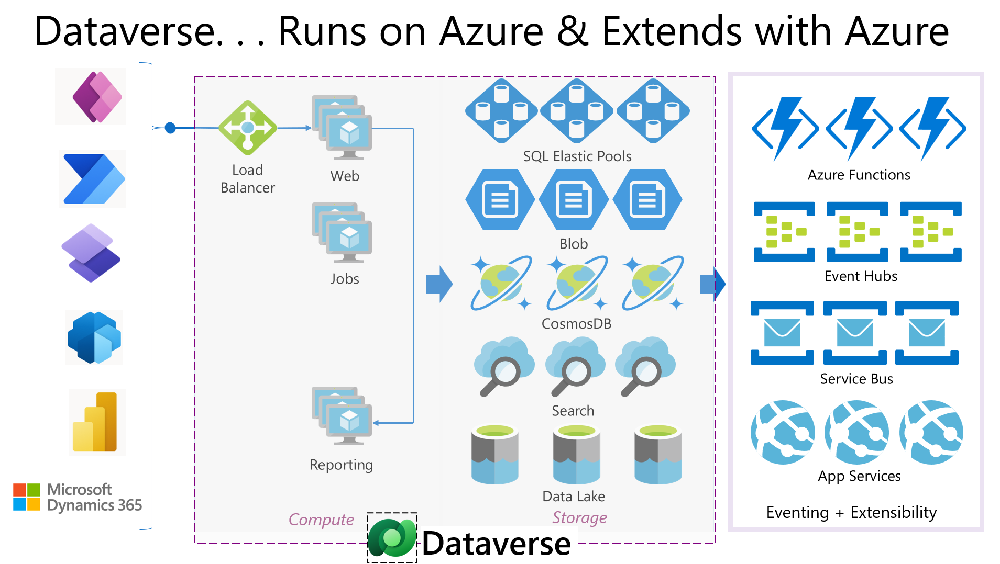

<head>
  <meta name="twitter:url" 
    content="https://microsoft.github.io/Low-Code/blog/slug-FIXME" />
  <meta name="twitter:title" 
    content="FIXME: Title Of Post" />
  <meta name="twitter:description" 
    content="FIXME: Post Description" />
  <meta name="twitter:image" 
    content="FIXME: Post Image" />
  <meta name="twitter:card" content="summary_large_image" />
  <meta name="twitter:creator" 
    content="@nitya" />
  <meta name="twitter:site" content="@AzureAdvocates" /> 
  <link rel="canonical" 
    href="https://microsoft.github.io/Low-Code/blog/slug-FIXME" />
</head>

Welcome to `Day #FIXME` of #28DaysOfLowCode!

The theme for this week is #FIXME. Yesterday we talked about #FIXME. Today we'll explore the topic of #FIXME.

## What We'll Cover
 * Section 1
 * Section 2
 * Section 3
 * Section 4
 * Exercise: Try this yourself!
 * Resources: For self-study!

<!-- FIXME: banner image -->

<!-- ************************************* -->
<!--  AUTHORS: ONLY UPDATE BELOW THIS LINE -->
<!-- ************************************* -->

## Introduction
Microsoft Dataverse is a low-code data platform that easily structures data, events, logic, analytics, and insights to support interconnected apps and processes in a secure and compliant manner. Dataverse being a polyglot storage, it can storage any type of data (relational, file, observational etc.). All this data is stored and represented externally as tables. Dataverse includes a base set of standard tables that cover typical scenarios, but you can also create custom tables specific to your organization and populate them with data. It is a critical element of Microsoft Power Platform, providing for all the data, events, analytics, and related processing, besides generating insights for citizen app makers and professional developers to build, store and manage data for their applications.

 
Figure 1: Microsoft Dataverse and Power Platform

## Dataverse -What’s under the hood?
Dataverse enables integrated, intelligent systems of action of the data that is stored. Dataverse achieves this by leveraging Azure services, so it is built on Azure and extends with Azure. 

## Section 1

## Section 2

## Section 3

## Section 4

## Exercise

## Resources